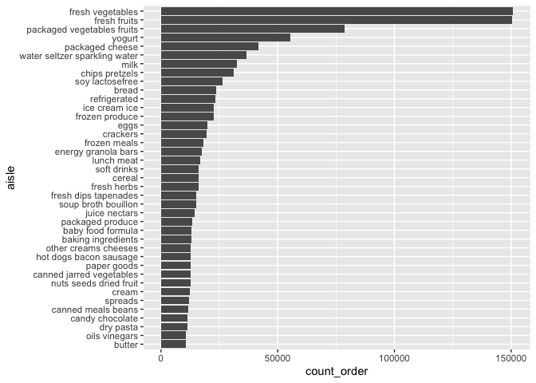
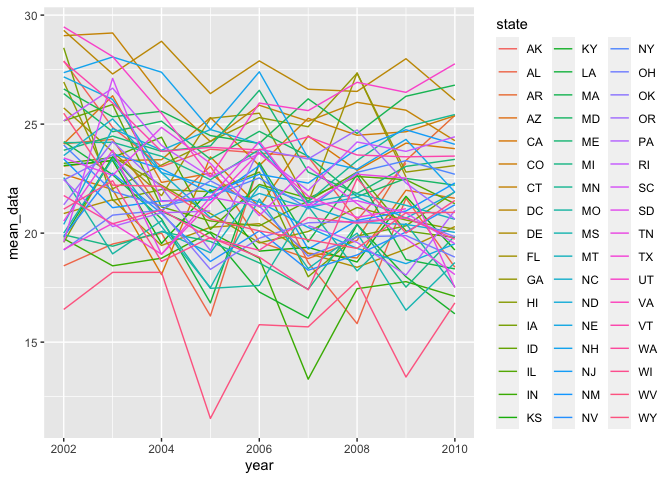
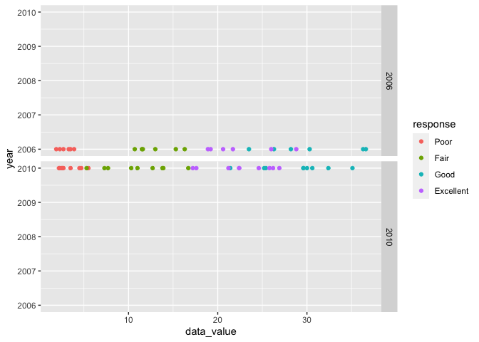
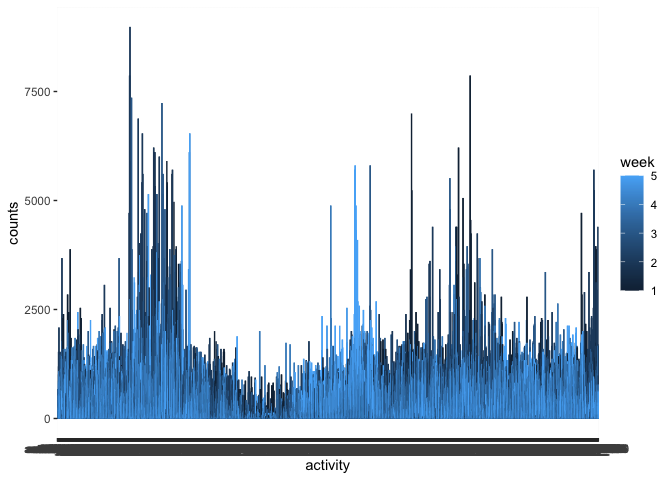

p8105\_HW3
================
Yongzi Yu yy3103

I’m an R Markdown document!

``` r
library(tidyverse)
```

    ## ── Attaching packages ─────────────────────────────────────── tidyverse 1.3.1 ──

    ## ✓ ggplot2 3.3.4     ✓ purrr   0.3.4
    ## ✓ tibble  3.1.2     ✓ dplyr   1.0.7
    ## ✓ tidyr   1.1.3     ✓ stringr 1.4.0
    ## ✓ readr   1.4.0     ✓ forcats 0.5.1

    ## ── Conflicts ────────────────────────────────────────── tidyverse_conflicts() ──
    ## x dplyr::filter() masks stats::filter()
    ## x dplyr::lag()    masks stats::lag()

``` r
library(tidyr)
library(readxl)
library(Hmisc)
```

    ## Loading required package: lattice

    ## Loading required package: survival

    ## Loading required package: Formula

    ## 
    ## Attaching package: 'Hmisc'

    ## The following objects are masked from 'package:dplyr':
    ## 
    ##     src, summarize

    ## The following objects are masked from 'package:base':
    ## 
    ##     format.pval, units

``` r
library(dplyr)

library(p8105.datasets)
```

# Problem 1

``` r
#load data
instacart =
  instacart %>%
  janitor::clean_names()
  
aisle=
  instacart %>%
  count(aisle) %>%
  arrange(desc(n))

aisle_plot=
  instacart %>%
  group_by(aisle) %>%
  summarise(
    count_order=n()
  ) %>%
  filter(count_order>10000)

ggplot(data=aisle_plot,aes(y=aisle,x=count_order))+geom_point()
```

<!-- -->

``` r
popular_items=
  instacart %>%
  filter(aisle=="baking ingredients"|aisle=="dog food care"|aisle== "packaged vegetables fruits") %>%
  group_by(aisle,product_name) %>%
  summarise(count_n=n()) %>%
  arrange(desc(count_n),.by_group=TRUE) %>%
  slice(1:3)
```

    ## `summarise()` has grouped output by 'aisle'. You can override using the `.groups` argument.

``` r
popular_items
```

    ## # A tibble: 9 x 3
    ## # Groups:   aisle [3]
    ##   aisle                      product_name                                count_n
    ##   <chr>                      <chr>                                         <int>
    ## 1 baking ingredients         Light Brown Sugar                               499
    ## 2 baking ingredients         Pure Baking Soda                                387
    ## 3 baking ingredients         Cane Sugar                                      336
    ## 4 dog food care              Snack Sticks Chicken & Rice Recipe Dog Tre…      30
    ## 5 dog food care              Organix Chicken & Brown Rice Recipe              28
    ## 6 dog food care              Small Dog Biscuits                               26
    ## 7 packaged vegetables fruits Organic Baby Spinach                           9784
    ## 8 packaged vegetables fruits Organic Raspberries                            5546
    ## 9 packaged vegetables fruits Organic Blueberries                            4966

``` r
mean_hour = 
  instacart %>%
  filter(product_name=="Pink Lady Apples"|product_name=="Coffee Ice Cream") %>%
  group_by(order_dow) %>%
  arrange(order_dow,.by_group=TRUE) %>%
  summarise(
    mean_hour=mean(order_hour_of_day)) %>%
  select(order_dow,mean_hour)
mean_hour
```

    ## # A tibble: 7 x 2
    ##   order_dow mean_hour
    ##       <int>     <dbl>
    ## 1         0      13.6
    ## 2         1      12.2
    ## 3         2      12.8
    ## 4         3      14.7
    ## 5         4      13.2
    ## 6         5      12.6
    ## 7         6      13.2

There are `134` and fresh vegetable is the most items ordered.

# Problem 2

``` r
data("brfss_smart2010")

#data clean
brfss=
  brfss_smart2010 %>%
  janitor::clean_names() %>%
  rename(state=locationabbr) %>%
  filter(topic == "Overall Health",
         response == "Excellent"|
         response == "Very Good"|
         response == "Good"|
         response == "Fair"|
         response == "Poor") %>%
  mutate(response= factor(response,levels=c("Poor","Fair","Good","Very Good","Excellent"))) %>%
  arrange(response)

location_2002=
  brfss %>%
  group_by(year,state) %>%
  summarise(count=n()) %>%
  filter (year == "2002",count>=7)
```

    ## `summarise()` has grouped output by 'year'. You can override using the `.groups` argument.

``` r
location_2010=
  brfss %>%
  group_by(year,state) %>%
  summarise(count=n()) %>%
  filter (year == "2010",count>=7)
```

    ## `summarise()` has grouped output by 'year'. You can override using the `.groups` argument.

``` r
excellent=
  brfss %>%
  filter (response=="Excellent") %>%
  group_by(year,state) %>%
  summarise(mean_data=mean(data_value)) %>%
  arrange(state,year) %>%
  select (year,state,mean_data)
```

    ## `summarise()` has grouped output by 'year'. You can override using the `.groups` argument.

``` r
ggplot(data=excellent,aes(y=mean_data,x=year,color=state))+geom_line()
```

    ## Warning: Removed 3 row(s) containing missing values (geom_path).

<!-- -->

``` r
two_panel=
  brfss %>%
  filter (year=="2006"|year=="2010") %>%
  filter(state=="NY")


ggplot(two_panel, aes(x=data_value,y=year,color=response))+geom_point()+
  facet_grid(year ~.)
```

<!-- --> -In
2002,there are AZ, CO, CT, DE, FL, GA, HI, ID, IL, IN, KS, LA, MA, MD,
ME, MI, MN, MO, NC, NE, NH, NJ, NV, NY, OH, OK, OR, PA, RI, SC, SD, TN,
TX, UT, VT, WA that are observed at 7 or more locations. In 2010,there
are AL, AR, AZ, CA, CO, CT, DE, FL, GA, HI, IA, ID, IL, IN, KS, LA, MA,
MD, ME, MI, MN, MO, MS, MT, NC, ND, NE, NH, NJ, NM, NV, NY, OH, OK, OR,
PA, RI, SC, SD, TN, TX, UT, VT, WA, WY that are observed at 7 or more
locations.

# Problem 3

``` r
acc = 
  read_csv("./data/accel_data.csv") %>%
  janitor::clean_names()
```

    ## 
    ## ── Column specification ────────────────────────────────────────────────────────
    ## cols(
    ##   .default = col_double(),
    ##   day = col_character()
    ## )
    ## ℹ Use `spec()` for the full column specifications.

``` r
acc_tidy=
  pivot_longer(
    acc,
    activity_1:activity_1440,
    names_to = "activity", 
    values_to = "counts") %>%
  mutate(
    weekend=ifelse(day == "Saturday" |day=="Sunday","Weekend","Weekday")
    )
  
acc_total = 
  acc_tidy %>%
  group_by(week,day_id,day) %>%
  summarise(total_min=sum(counts))
```

    ## `summarise()` has grouped output by 'week', 'day_id'. You can override using the `.groups` argument.

``` r
ggplot(acc_tidy, aes(y=counts,x=activity,color=week))+geom_line()
```

<!-- -->
